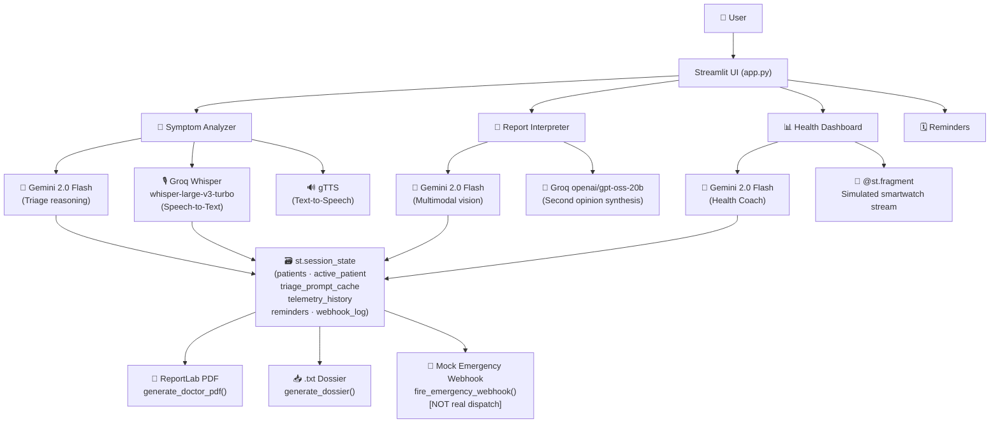

```
███╗   ███╗███████╗██████╗ ██╗███████╗ ██████╗ █████╗ ███╗   ██╗
████╗ ████║██╔════╝██╔══██╗██║██╔════╝██╔════╝██╔══██╗████╗  ██║
██╔████╔██║█████╗  ██║  ██║██║███████╗██║     ███████║██╔██╗ ██║
██║╚██╔╝██║██╔══╝  ██║  ██║██║╚════██║██║     ██╔══██║██║╚██╗██║
██║ ╚═╝ ██║███████╗██████╔╝██║███████║╚██████╗██║  ██║██║ ╚████║
╚═╝     ╚═╝╚══════╝╚═════╝ ╚═╝╚══════╝ ╚═════╝╚═╝  ╚═╝╚═╝  ╚═══╝
          AI  ·  Triage  ·  Dashboard  ·  India
```

> **Intelligent multimodal clinical triage assistant — powered by Gemini 2.0 Flash**

[](https://python.org)
[](https://streamlit.io)
[](LICENSE)
[](https://mediscan--ai.streamlit.app/)

---

## > live_demo

🌐 **[https://mediscan--ai.streamlit.app/](https://mediscan--ai.streamlit.app/)**

> ⚠️ **Prototype disclaimer:** The SOS / emergency-alert feature points at a **mock webhook endpoint** (`https://hook.us1.make.com/mock-emergency`). It is **not connected to real emergency dispatch** services. The UI and source code both state this explicitly. Do not rely on it in a genuine emergency.

---

## > overview

MediScan AI is a Streamlit-based Clinical Decision Support System (CDSS) designed for resource-constrained medical environments in India. It gives patients and first-responders a conversational triage interface, multimodal lab-report analysis, a live simulated biometric dashboard, and a care-plan reminder system — all in a single-page web app that degrades gracefully when API keys are absent.

The system targets triage *assistance*, not diagnosis replacement. Every AI response includes a CDSCO compliance disclaimer, and no API pathway leads to pharmacological prescriptions.

---

## > feature_matrix

| Tab / Feature | What it does | Core Technologies |
|---|---|---|
| 🔬 **Symptom Analyzer** | Conversational triage with structured intake (severity, duration, onset, body areas); ranked differential diagnosis | `gemini-2.0-flash` · Groq `whisper-large-v3-turbo` (STT) · `gTTS` (TTS) |
| 📄 **Medical Report Interpreter** | Upload / camera-capture lab panels or symptom images; OCR-style extraction with biomarker table + second opinion | `gemini-2.0-flash` (multimodal vision) · Groq `openai/gpt-oss-20b` (second opinion) |
| 📊 **Health Dashboard** | 6-month biometric editor, risk score chart, live simulated smartwatch telemetry, AI preventative health coach | `gemini-2.0-flash` · `seaborn` / `matplotlib` · `@st.fragment(run_every=2)` |
| 🗓️ **Reminders & Care Plan** | Date-stamped care reminders per patient with overdue status, toggle, and delete | Pure `st.session_state` |
| **Sidebar — Patient Profiles** | Multi-patient records, profile editor (age, sex, weight), weight unit toggle (kg/lb) | `st.session_state` dict keyed by patient name |
| **Sidebar — Emergency Contact** | SOS alert trigger → `fire_emergency_webhook()` → mock webhook POST | `requests` |
| **Sidebar — Export Dossier** | Plain-text `.txt` dossier download (single or all patients) | Lazy `lambda` callable closures |
| **Sidebar — Doctor PDF Handoff** | Clinician-ready PDF with profile table, intake table, biometrics, triage transcript, physician-notes section | `reportlab` (Platypus `SimpleDocTemplate`) |
| **Language selector** | Response language drives *both* Gemini system instruction and gTTS TTS language | `LANG_MAP` (English, Hindi, Marathi, Bengali, Spanish) |

---

## > architecture



---

## > tech_stack

| Library | Version (in requirements.txt) | Purpose |
|---|---|---|
| `streamlit` | latest | UI framework, session state, fragments |
| `google-genai` | latest | Gemini 2.0 Flash — triage, vision, health coach |
| `groq` | latest | Whisper STT + second-opinion LLM |
| `gTTS` | 2.5.1 | Text-to-speech (multilingual) |
| `reportlab` | latest | PDF generation via Platypus |
| `pandas` | latest | Biometric DataFrame, CSV export |
| `numpy` | latest | Simulated telemetry random-walk |
| `seaborn` | latest | Dual y-axis live telemetry line chart |
| `matplotlib` | latest | Telemetry chart backend |
| `Pillow` | latest | PIL image loading for vision analysis |
| `requests` | 2.31.0 | Emergency webhook POST |
| `hashlib` | stdlib | Audio dedup + prompt cache keys (MD5) |
| `uuid` | stdlib | Stable IDs for reports and reminders |

---

## > ./setup.sh

**Prerequisites:** Python 3.10+, Git

### 1 — Clone the repository

```bash
git clone https://github.com/shreyaspatankar-07/MediScan-AI.git
cd MediScan-AI
```

### 2 — Create and activate a virtual environment

```bash
python -m venv .venv

# macOS / Linux
source .venv/bin/activate

# Windows (PowerShell)
.venv\Scripts\Activate.ps1
```

### 3 — Install dependencies

```bash
pip install -r requirements.txt
```

### 4 — Configure API keys

Create `.streamlit/secrets.toml` (this file is git-ignored):

```toml
GEMINI_API_KEY = "your-google-gemini-api-key"
GROQ_API_KEY   = "your-groq-api-key"
```

The keys are read via `st.secrets["GEMINI_API_KEY"]` and `st.secrets.get("GROQ_API_KEY")`.

> **Graceful degradation** — confirmed in source:
> - Missing `GEMINI_API_KEY` → sidebar warning banner; all triage / vision / coach buttons disabled (`disabled=not _api_ready`).
> - Missing `GROQ_API_KEY` → sidebar warning banner; voice input and second-opinion buttons disabled (`disabled=groq_client is None`).
> Both keys are optional at startup; the app does not crash.

### 5 — Run locally

```bash
streamlit run app.py
```

App opens at `http://localhost:8501`.

---

## > project_structure

```
MediScan-AI/
├── app.py                  # Single entrypoint — all tabs, helpers, UI (1514 lines)
├── requirements.txt        # Pinned/unpinned dependencies (11 entries)
├── LICENSE                 # MIT — Copyright 2026 Shreyas Chandrakant Patankar
├── README.md               # This file
├── .streamlit/
│   ├── secrets.toml        # API keys (git-ignored, not committed)
│   └── config.toml         # Streamlit theme overrides
├── .devcontainer/          # Dev container config (Codespaces/VS Code)
└── .gitignore
```

> This is a **flat single-file application**. All functions (`new_patient_record`, `fire_emergency_webhook`, `metric_flag`, `render_empty_state`, `generate_doctor_pdf`, `generate_dossier`, `render_telemetry`), constants, session-state initialization, and UI rendering live inside `app.py`.

---

## > known_limitations

<details>
<summary>📋 Click to expand full limitations & disclaimers</summary>

These limitations are derived directly from in-code comments, UI captions, and docstrings:

### 🚨 Mock Emergency Webhook
The `fire_emergency_webhook()` function POSTs to `https://hook.us1.make.com/mock-emergency`.
Both the code docstring and the UI caption state explicitly: *"This prototype points at a mock webhook — do not rely on it in a real emergency."*

### 📡 Simulated Wearable Telemetry
The `render_telemetry()` fragment generates data using NumPy random-walk (`np.random.randint`, `np.clip`). A UI caption reads: *"Simulated demo data — not connected to a real wearable device."*
The stream auto-pauses after 30 ticks (60 seconds) via a resource guard counter (`telemetry_tick_count`).

### 🌐 gTTS Network Dependency
`gTTS` makes an HTTP request to Google Translate's TTS service on every call. A network failure will fall through to a `try/except` and display *"Audio synthesis is temporarily unavailable"* — it will not crash the app, but TTS is unavailable offline.

### 🔒 No Authentication / No Cross-Session Persistence
All patient records live in `st.session_state` — a single browser session. There is no database, no login, and no cross-device persistence. Multiple users in different browser tabs have completely separate, isolated state. A page refresh clears all data.

### ⚕️ Not a Medical Device
MediScan AI is a student capstone prototype. It includes a CDSCO disclaimer in every AI system prompt and every generated PDF. It is **not** HIPAA-compliant, **not** CE/FDA-approved, and should **not** be used for actual clinical decisions.

</details>

---

## > roadmap

- **Real emergency dispatch integration** — replace mock webhook with a verified emergency messaging API (e.g., Twilio SMS or a registered EMS endpoint)
- **Persistent backend storage** — replace `st.session_state` with a PostgreSQL or Firestore database so patient records survive page refreshes and support multiple users
- **Authentication layer** — add OAuth2 / OTP-based login to enable proper per-user data isolation
- **Real wearable API integration** — replace the NumPy random-walk telemetry generator with a live Bluetooth LE / Health Connect / Apple HealthKit data bridge
- **CI/CD pipeline** — add GitHub Actions for lint + test on push, and automate deployment to Streamlit Cloud

---

## > license

MIT License — Copyright (c) 2026 **Shreyas Chandrakant Patankar**

See [LICENSE](LICENSE) for full terms.

---

## > footer

🌐 **Live app:** [https://mediscan--ai.streamlit.app/](https://mediscan--ai.streamlit.app/)

*MediScan AI — A MirAI School of Technology Capstone Project*