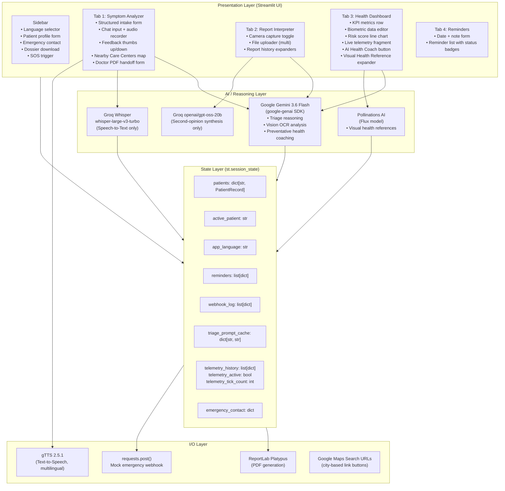

# MediScan AI — Technical Design Document

**Project:** MediScan AI  
**Author:** Shreyas Chandrakant Patankar  
**Institution:** MirAI School of Technology  
**Repository:** [github.com/shreyaspatankar-07/MediScan-AI](https://github.com/shreyaspatankar-07/MediScan-AI)  
**Live Deployment:** [https://mediscan--ai.streamlit.app/](https://mediscan--ai.streamlit.app/)  
**Document Version:** 1.0 · 2026-08-25

---

## 1. Purpose & Scope

This document describes the internal architecture, data-flow, API integration strategy, and design decisions of MediScan AI. It is written for two audiences:

1. **Capstone graders** — to verify that the engineering choices are deliberate, documented, and defensible.
2. **Future maintainers** — to provide a single reference for understanding and extending the codebase.

Sections cover: the layered system architecture, step-by-step data-flow traces for each major user journey, how each external API is integrated and why, the role and design of each key function, state management tradeoffs, and non-functional considerations (latency, resource use, safety framing).

> This document is internally consistent with `README.md`. All model names, function names, session-state keys, and architectural claims were verified directly against the source code (`app.py`, 1514 lines) before writing.

---

## 2. System Architecture

### 2.1 Layered Architecture Diagram



### 2.2 PatientRecord Schema

Each entry in `st.session_state.patients` is a Python `dict` created by `new_patient_record()`:

```python
{
    "profile": {
        "age": int,
        "sex": str,
        "weight_kg": float,
        "chronic_conditions": str
    },
    "chat_history":           list[dict],   # {"role": "user"|"assistant", "content": str}
    "archived_conversations": list[dict],   # {"timestamp": str, "messages": list}
    "report_history":         list[dict],   # {"id": str, "timestamp": str, "filename": str, "result": str}
    "health_metrics":         pd.DataFrame, # columns: Month, Resting_HR, Systolic_BP, Fasting_Glucose, Health_Risk_Score
    "coach_recommendation":   str | None,
    "feedback":               dict,         # {message_index: "up"|"down"}
    "last_intake":            dict | None,  # {"severity", "duration", "onset", "body_areas"}
}
```

---

## 3. Data Flow Walkthroughs

### 3.1 Symptom Triage Flow

```
User submits text / records audio
        │
        ├── [Audio path] st.audio_input() → audio bytes hashed with hashlib.md5()
        │       → compared against active_record["last_processed_audio_hash"]
        │       → if new: groq_client.audio.transcriptions.create(
        │             file=("audio.wav", audio_bytes),
        │             model="whisper-large-v3-turbo"
        │         ) → transcription.text appended to final_symptom_text
        │
        ├── Structured intake captured: severity, duration, onset, body_areas
        │       → stored in active_record["last_intake"]
        │       → injected into dynamic_system_instruction as STRUCTURED INTAKE block
        │
        ├── dynamic_system_instruction assembled:
        │       TRIAGE_SYSTEM_INSTRUCTION (base)
        │       + patient biometric baseline (age, sex, weight, conditions)
        │       + structured intake summary
        │       + CRITICAL LANGUAGE INSTRUCTION (st.session_state.app_language)
        │
        ├── prompt_cache_key = hashlib.md5(
        │       f"{active_patient}_{symptom_text}_{language}_{intake_summary}"
        │   ).hexdigest()
        │
        ├── Cache hit? → serve from st.session_state.triage_prompt_cache[key]
        │                  (shows "⚡ Loaded from session cache" caption)
        │
        └── Cache miss? → client.models.generate_content(
                    model="gemini-3.6-flash",
                    contents=conversation_context,
                    config=GenerateContentConfig(system_instruction=dynamic_system_instruction)
                )
                → response.text cached in triage_prompt_cache[key]
                → structured JSON urgency parsed with re.search() + json.loads()
                → fallback: keyword scan on response text
                → if urgency in ("High", "Emergency"): fire_emergency_webhook()
                → gTTS(text=clean_text, lang=tts_lang).write_to_fp(audio_fp)
                → st.audio(audio_fp) played inline
                → assistant reply appended to active_record["chat_history"]
```

### 3.2 Vision / Report Analysis Flow

```
User opens camera or uploads file(s)
        │
        ├── st.camera_input() or st.file_uploader(accept_multiple_files=True)
        │       → image_sources: list[(filename, file_object)]
        │
        ├── "Analyze Image(s)" button clicked
        │   (DESIGN NOTE: outside st.form — single-click trigger, no batched input needed)
        │
        ├── Vision context assembled:
        │       patient profile: age, sex, weight, conditions
        │       + recent 3 chat turns from active_record["chat_history"][-3:]
        │         each truncated to 200 chars
        │         (DESIGN NOTE: limits tokens / cost while keeping acute symptom context)
        │
        ├── For each image source:
        │       pil_image = Image.open(fobj)
        │       → client.models.generate_content(
        │             model="gemini-3.6-flash",
        │             contents=[context_text, "Please analyze this medical image.", pil_image],
        │             config=GenerateContentConfig(system_instruction=lang_vision_instruction)
        │         )
        │       → result stored with uuid.uuid4().hex as stable ID
        │         in active_record["report_history"]
        │
        └── [Optional] "Second Opinion" button:
                groq_client.chat.completions.create(
                    model="openai/gpt-oss-20b",
                    messages=[{system: "Senior Medical Synthesizer"}, {user: primary_result}]
                )
                → displayed inline as st.info()
```

### 3.3 Doctor Handoff / PDF Export Flow

```
User fills doctor handoff st.form (doctor name, email, referring note, include checkboxes)
        │
        ├── form_submit_button clicked: "📄 Generate Doctor Summary PDF"
        │
        ├── generate_doctor_pdf(
        │       patient_name, record, emergency_contact, language,
        │       include_chat, include_reports, include_biometrics,
        │       doctor_name, referring_note
        │   ) called
        │
        ├── ReportLab Platypus story assembled in-memory (io.BytesIO):
        │       Header: "🩺 MediScan AI — Clinical Handoff Summary" + timestamp
        │       → Patient Profile table (5–6 rows, colWidths=[1.7in, 4.3in])
        │       → Structured Intake table (if active_record["last_intake"] exists)
        │       → 6-Month Biometric Trend table (if include_biometrics and df not empty)
        │       → AI Triage Transcript (if include_chat and chat_history not empty)
        │       → Lab/Visual Report Analyses (if include_reports and report_history not empty)
        │       → PageBreak + Physician Notes section (10 × blank ruled lines)
        │       → CDSCO Compliance Disclaimer (footer)
        │
        ├── doc.build(story) → buf.seek(0) → returned as BytesIO
        │
        ├── PDF bytes stored in st.session_state["_doctor_pdf_bytes"]
        │
        └── st.download_button("📥 Download Doctor Summary PDF", data=bytes, mime="application/pdf")
```

### 3.4 Live Telemetry Stream Flow

```
User clicks "🟢 Start Live Monitor (Simulated Demo)"
        │
        ├── toggle_telemetry() sets:
        │       st.session_state.telemetry_active = True
        │       st.session_state.telemetry_tick_count = 0
        │       st.session_state.telemetry_history = [5 seed readings]
        │
        ├── @st.fragment(run_every=2) render_telemetry() ticks every 2 seconds
        │
        ├── Resource guard check:
        │       telemetry_tick_count += 1
        │       if telemetry_tick_count > 30:
        │           telemetry_active = False  # auto-pause after 60s
        │           return
        │
        ├── NumPy random-walk generates new reading:
        │       HR, BP systolic/diastolic, ECG label, AFib check,
        │       SpO2, respiratory rate, HRV, skin temp deviation,
        │       fall-detection status, stress score, active calories
        │
        ├── New reading appended to telemetry_history (rolling window: max 15 entries)
        │
        ├── Metrics displayed in 4 category sub-tabs:
        │       💓 Cardiovascular · 🫁 Respiratory & Blood · 🛌 Sleep & Recovery · ⚠️ Safety & Exertion
        │
        ├── if SpO2 < 92: fire_emergency_webhook({"alert": "low_spo2", ...})
        │
        └── Dual y-axis Seaborn chart rendered:
                ax: Pulse (#7c4dff) + SpO2 (#ff6b6b)
                ax2 (twinx): HRV (#00d2d3)
                White background, periwinkle dashed grid
```

---

## 4. API Integration Strategy

### 4.1 Google Gemini (`google-genai` SDK)

**Model used:** `gemini-3.6-flash` (all three use-cases)

**Initialization:**
```python
client = genai.Client(api_key=st.secrets["GEMINI_API_KEY"])
```
Wrapped in `try/except`; `_api_ready = False` on failure, disabling dependent buttons.

**Three distinct system instruction contexts:**

| Context | Instruction Constant | Key contract |
|---|---|---|
| Symptom Triage | `TRIAGE_SYSTEM_INSTRUCTION` | Must output exactly one `{"urgency_level": ..., "top_conditions": [...], "confidence": ...}` JSON block (machine-parsed) + CDSCO disclaimer |
| Vision Analysis | `VISION_SYSTEM_INSTRUCTION` | Extract biomarkers into markdown table vs. reference ranges; flag `⚠️ Critical Flags`; append CDSCO disclaimer |
| Health Coaching | `HEALTH_COACH_SYSTEM_INSTRUCTION` | Return exactly 3 bullet-point wellness recommendations from CSV biometric data; append CDSCO disclaimer |

Each system instruction is dynamically extended at call time to inject:
- Patient biometric baseline (age, sex, weight, conditions)
- Target language (`CRITICAL LANGUAGE INSTRUCTION: respond in {app_language}`)
- Structured intake summary (triage only)

**Prompt deduplication (triage only):**
```python
key = hashlib.md5(f"{patient}_{text}_{language}_{intake}".encode()).hexdigest()
if key in st.session_state.triage_prompt_cache:
    # serve cached; no API call
else:
    # call Gemini, store result in cache
```
This avoids redundant paid API calls on accidental double-submission of identical prompts.

**Error handling example** (triage path):
```python
try:
    response = client.models.generate_content(...)
    assistant_reply = response.text
    st.session_state.triage_prompt_cache[key] = assistant_reply
except Exception as exc:
    logger.error("Gemini triage call failed: %s", exc)
    assistant_reply = f"⚠️ **Error communicating with Gemini:** `{exc}`"
```
All external calls follow this pattern: `try/except`, `logger.error/warning`, inline `st.error/st.warning` — never an unhandled exception reaching the user.

---

### 4.2 Groq (Two Architecturally Separate Roles)

The source code comments explicitly document the separation of concerns:

```python
# Architecture: Groq is used EXCLUSIVELY for Whisper-based speech-to-text
# transcription, leveraging its low-latency inference for real-time audio.
# All reasoning and generation tasks are handled by Gemini above.
```

**Role 1 — Whisper STT** (`whisper-large-v3-turbo`):
```python
transcription = groq_client.audio.transcriptions.create(
    file=("audio.wav", audio_value.read()),
    model="whisper-large-v3-turbo"
)
```
Used only when a voice recording is provided. Transcript is appended to the user's text message before the Gemini triage call.

**Role 2 — Second-opinion LLM** (`openai/gpt-oss-20b`):
```python
groq_client.chat.completions.create(
    model="openai/gpt-oss-20b",
    messages=[
        {"role": "system", "content": "You are a Senior Medical Synthesizer..."},
        {"role": "user", "content": f"Primary Analysis:\n{r['result']}"},
    ]
)
```
Used only in Tab 2 (Report Interpreter) when the user clicks "⚖️ Second Opinion". This is kept separate from Gemini to provide an independent model perspective on OCR analysis results — an architectural separation-of-concerns decision, not a cost optimization.

**Initialization:**
```python
groq_key = st.secrets.get("GROQ_API_KEY")
groq_client = Groq(api_key=groq_key) if groq_key else None
```
`st.secrets.get()` (not `[]`) means missing key returns `None` gracefully, not a `KeyError`.

---

### 4.3 gTTS (Text-to-Speech)

```python
tts = gTTS(text=clean_text, lang=tts_lang, slow=False)
audio_fp = io.BytesIO()
tts.write_to_fp(audio_fp)
st.audio(audio_fp, format="audio/mp3")
```

Language is determined by `LANG_MAP` which maps the sidebar language selector value to gTTS language codes:
```python
LANG_MAP = {
    "English": "en", "Hindi (हिन्दी)": "hi", "Marathi (मराठी)": "mr",
    "Bengali (বাংলা)": "bn", "Spanish (Español)": "es"
}
```
This makes the TTS language always consistent with the Gemini response language — both are driven by the same selector value.

gTTS requires an active network connection (HTTP to Google TTS service). Failures are caught and surface as `st.caption("🔇 Audio synthesis is temporarily unavailable.")`.

---

### 4.4 Pollinations AI (Image Generation API)

```python
def generate_pollinations_image(prompt: str, width: int = 800, height: int = 480) -> str:
    import urllib.parse
    encoded_prompt = urllib.parse.quote(prompt)
    return (
        f"https://image.pollinations.ai/prompt/{encoded_prompt}"
        f"?width={width}&height={height}&model=flux&nologo=true&seed=42"
    )
```

**Architectural Role:**  
Pollinations AI is integrated as an open, zero-authentication text-to-image service powering the "Visual Health Reference" section in Tab 3 (Health Dashboard).

**Dynamic Prompt Selection:**  
When an AI Health Coach insight is generated, the app evaluates the patient's latest biometric baseline to select a relevant medical illustration topic:
1. `Health_Risk_Score >= 60` → Cardiovascular system & heart anatomy diagram
2. `Fasting_Glucose > 100` → Blood glucose monitoring & diabetes prevention
3. `Systolic_BP > 130` → Blood pressure & arterial health diagram
4. `Resting_HR > 100` → Heart rate pulse & cardio fitness illustration
5. Normal baseline → General preventative wellness & lifestyle illustration

**Caching Strategy:**  
A fixed `seed=42` parameter is included in the URL query string. This ensures that re-renders for identical biometric conditions resolve to the exact same URL, enabling standard browser HTTP caching without server-side image storage overhead.

---

## 5. Logic Modules Breakdown

| Function | Defined at | Responsibility |
|---|---|---|
| `new_patient_record()` | line 291 | Factory for a blank patient dict with default profile, empty lists, and a seeded 6-month biometric DataFrame |
| `blank_health_metrics()` | line 280 | Returns a `pd.DataFrame` with 6 months of plausible seed biometrics (March–August baseline) |
| `fire_emergency_webhook()` | line 305 | POSTs JSON payload to `EMERGENCY_WEBHOOK_URL` with 4-second timeout; logs outcome; appends to `webhook_log`; returns `bool` |
| `metric_flag()` | line 335 | Applies clinical threshold logic to biometric values; returns `(label, color)` tuple (Low/Normal/Elevated/High) |
| `render_empty_state()` | line 355 | Renders a styled white card with dashed periwinkle border for empty list states (no reminders, no reports) |
| `generate_pollinations_image()` | line 374 | Builds a Pollinations AI image URL with Flux model, fixed seed, and URL-encoded medical prompt |
| `generate_doctor_pdf()` | line 388 | Builds a multi-page ReportLab PDF from patient record; returns `io.BytesIO`; includes: profile table, intake table, biometrics table, triage transcript, report history, blank physician-notes ruled section, CDSCO disclaimer footer |
| `generate_dossier()` | line 686 | Builds a plain-text patient summary string; used by sidebar download buttons via lazy-evaluated lambda closures |
| `render_telemetry()` | line ~1235 | `@st.fragment(run_every=2)` component — see §5.1 below |

### 5.1 `render_telemetry()` — Resource Guard Design

`render_telemetry()` is decorated with `@st.fragment(run_every=2)`, which causes Streamlit to re-execute the fragment body every 2 seconds independently of the main script rerun cycle.

**Problem:** An unbounded `run_every=2` loop would continue indefinitely once started, consuming server-side compute even if the user navigates to a different tab, consuming resources proportional to session lifetime.

**Solution — tick-count auto-pause:**
```python
st.session_state.telemetry_tick_count += 1
if st.session_state.telemetry_tick_count > 30:
    st.session_state.telemetry_active = False
    st.session_state.telemetry_tick_count = 0
    st.info("⏸️ Live stream auto-paused after 60 seconds (resource optimization guard).")
    return
```

After 30 ticks (30 × 2s = 60 seconds), the fragment sets `telemetry_active = False` and exits early. The fragment itself still ticks (the decorator cannot be removed at runtime), but the early `return` on the inactive guard means no computation happens after the pause. Clicking "Start Live Monitor" again resets the counter.

The `toggle_telemetry()` on-click callback also resets `telemetry_tick_count = 0` so the clock always starts fresh on each activation.

---

## 6. State Management Design

### 6.1 Why `st.session_state`

`st.session_state` was chosen as the sole persistence layer because:

1. **Scope matches prototype scope** — this is a single-user, single-browser-tab demonstration. There is no multi-user scenario in a capstone prototype.
2. **Zero infrastructure** — no database setup, connection pooling, or ORM is needed. State is allocated and garbage-collected with the browser session.
3. **Streamlit-native patterns** — `st.session_state` is the idiomatic Streamlit mechanism for holding mutable state across reruns.

### 6.2 Multi-Patient Namespacing

```python
st.session_state.patients = {
    "Patient 1": {PatientRecord},
    "Patient 2": {PatientRecord},
    ...
}
```

Patient records are stored as a dict keyed by patient name string. The active patient is referenced by `st.session_state.active_patient`. This means:
- Switching patients only changes the `active_patient` key — no data copying.
- All tabs read from `active_record = st.session_state.patients[st.session_state.active_patient]` at the top of each render cycle.
- Patient names are unique (enforced by the "Add Patient" guard: `if new_name not in st.session_state.patients`).

### 6.3 Tradeoffs

| Tradeoff | Implication |
|---|---|
| No cross-device persistence | Refreshing the browser clears all data |
| No concurrent multi-user isolation | All patients in one session share the same `emergency_contact`, `app_language`, `reminders` list, and `webhook_log` |
| No authentication | Any user with the URL has full access to all session data |
| No ACID guarantees | Concurrent modifications from multiple browser tabs to the same Streamlit Cloud session could produce inconsistent state |

These tradeoffs are documented in the README's "Known Limitations" section and are acceptable for a prototype with a single-user demo model.

---

## 7. Non-Functional Considerations

### 7.1 Latency & Cost Management

**Prompt caching (triage):**  
`triage_prompt_cache` keyed by MD5 hash of `patient + text + language + intake`. Identical prompts return instantly without an API call, preventing duplicate charges on accidental double-submissions.

**Vision context truncation:**  
Chat history passed to the multimodal vision call is truncated to `[-3:]` turns with each message capped at 200 characters. Documented in code comment:
> *"Truncating chat history to recent 3 turns (max 200 chars/msg) to maintain optimal token efficiency, focus vision context on acute symptoms, and manage API cost."*

**Telemetry resource guard:**  
The `@st.fragment(run_every=2)` auto-pause after 30 ticks prevents indefinite background compute consumption (see §5.1).

### 7.2 Safety & Compliance Framing

Every Gemini system instruction (`TRIAGE_SYSTEM_INSTRUCTION`, `VISION_SYSTEM_INSTRUCTION`, `HEALTH_COACH_SYSTEM_INSTRUCTION`) ends with a mandatory CDSCO disclaimer that the model is instructed to append verbatim to every response. The same disclaimer appears in every generated PDF footer.

The triage system prompt explicitly prohibits prescriptions:
> *"You are a triage assistant, NOT a prescribing physician. You must NEVER prescribe medications or suggest specific pharmacological dosages."*

The mock webhook is labelled in three places:
1. Code comment in `fire_emergency_webhook()` docstring
2. `st.caption()` under the SOS button in the sidebar
3. `st.error()` message shown when webhook does not confirm delivery

### 7.3 Error Surface Coverage

Every external I/O operation is wrapped:

```
gemini text call    → try/except Exception → logger.error + inline st.error / degraded reply
gemini vision call  → try/except Exception → logger.error + inline st.error
groq whisper        → try/except Exception → logger.error + inline st.error
groq second opinion → try/except Exception → logger.error + inline st.error
gTTS synthesis      → try/except Exception → logger.warning + inline st.caption
webhook POST        → try/except RequestException → logger.error + returns False
pdf generation      → try/except Exception → logger.error + inline st.error
audio hashing       → try/except Exception → logger.warning + inline st.warning
```

No external call can reach the user as an unhandled Python traceback.

---

## 8. Future Architecture Considerations

The following changes would be necessary to evolve MediScan AI from a capstone prototype to a production-grade clinical tool:

| Component | Current (Prototype) | Production Change |
|---|---|---|
| **Persistence** | `st.session_state` (in-memory) | PostgreSQL or Firestore with per-user data isolation |
| **Authentication** | None | OTP/OAuth2 login; per-user session tokens |
| **Emergency dispatch** | Mock webhook (`hook.us1.make.com`) | Verified EMS API integration (Twilio, AWS SNS, or a government-registered endpoint) |
| **Telemetry** | NumPy random-walk simulation | Real Bluetooth LE / Health Connect / Apple HealthKit bridge |
| **Prompt caching** | Session-scoped MD5 dict (lost on refresh) | Redis-backed shared cache with TTL, or Gemini Context Caching API |
| **PDF delivery** | Browser download button | Encrypted FHIR-compliant document delivery |
| **Compliance** | CDSCO disclaimer text only | Formal CDSCO SaMD registration, data localisation (India), audit logging |
| **Infrastructure** | Streamlit Cloud (single process) | Horizontally scalable deployment with load balancing |

---

*End of Technical Design Document*  
*MediScan AI · MirAI School of Technology Capstone · 2026*
